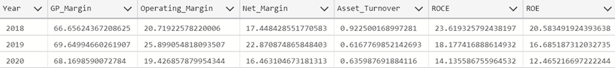

# Financial Reporting and Analysis System using SQL

Project Description
Overview:
The project aims to develop a comprehensive financial reporting and analysis system using SQL (Structured Query Language). The system will utilize five key datasets: general ledger, charts of accounts, territory, calendar, and cash flow. By leveraging these datasets, the system will generate essential financial reports including Profit and Loss (P&L) statements, Balance Sheets, and Cash Flow statements.

Project Goal
Design SQL queries to generate accurate and timely financial reports including Profit and Loss statements, Balance Sheets, and Cash Flow statements.

Tools & Library Used
  

Project Result
Click here to view the full code

A. Profit & Loss Statement
Create pivot table report of profit and loss for 2018, 2019, 2020

Comparison with Excel Results

Create pivot table report of profit and loss for 2018, 2019, 2020 for country France

Comparison with Excel Results for France

Calculating Profit & Loss Statement Related Values

Comparison with Excel Values

B. Balance Sheet
Create pivot table report of balance sheet for 2018, 2019, 2020

Comparison with Excel Results

Calculating Balance Sheet Related Values

Comparison with Excel Results

C. Calculating Ratios
Financial Ratios

D. Cash Flow Statement
Calculating Cash Flow Related Values

Comparison with Excel Results

